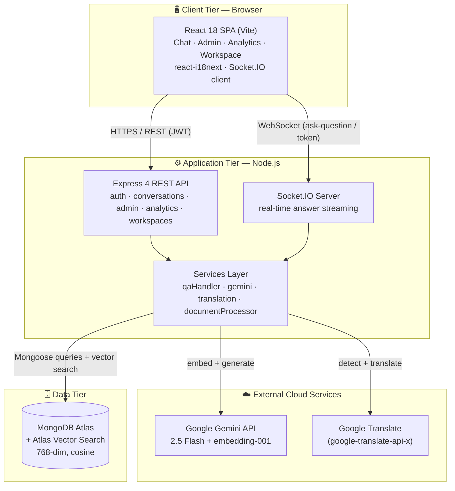
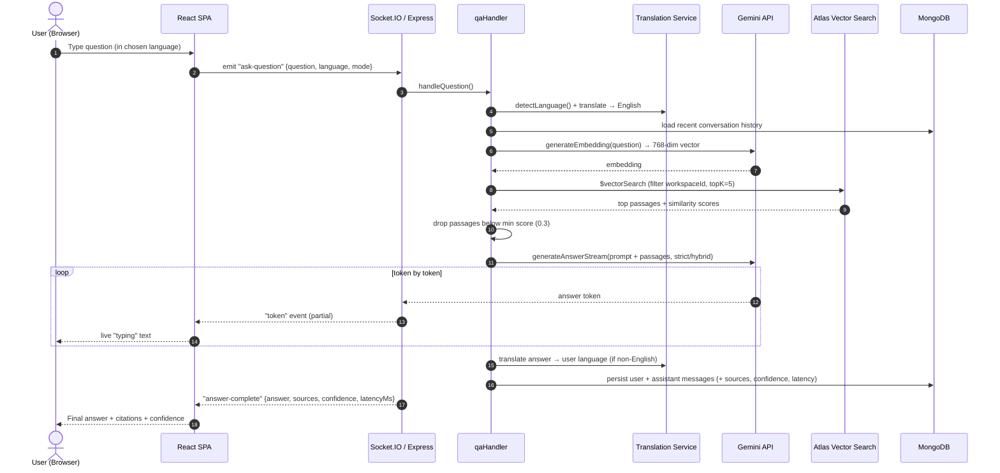
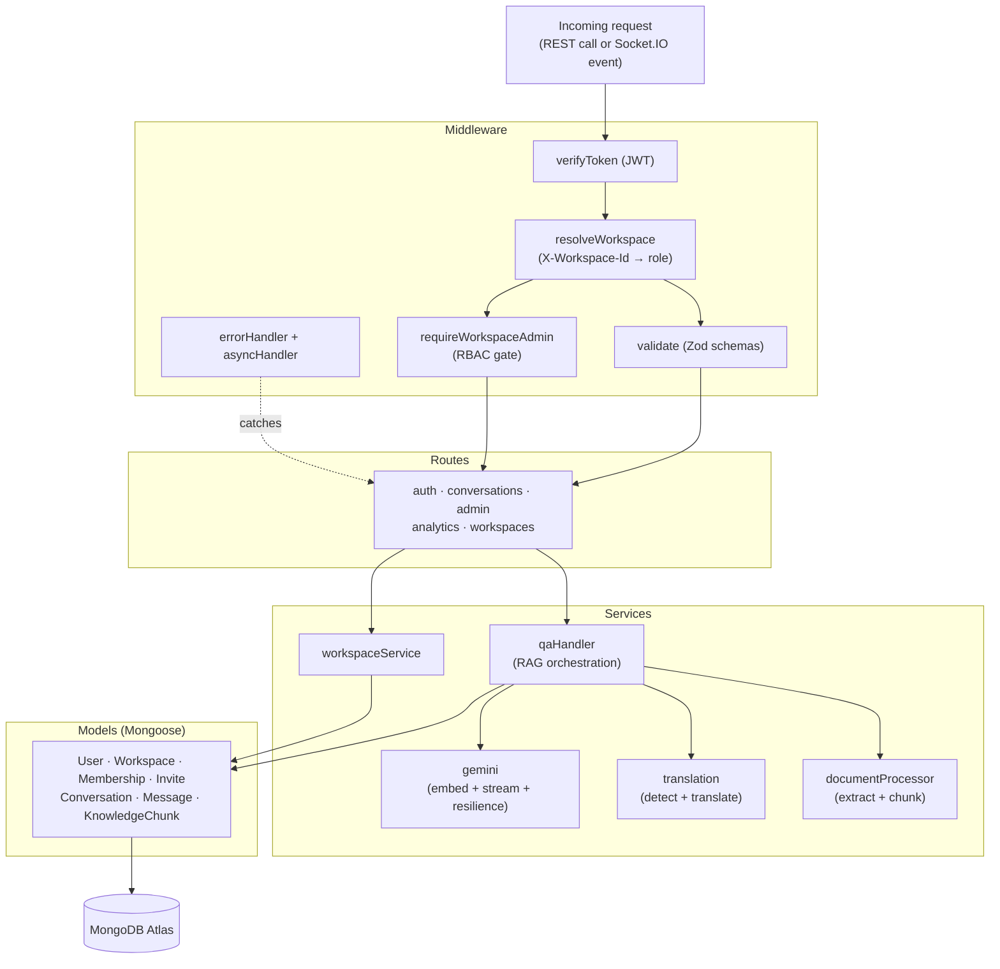
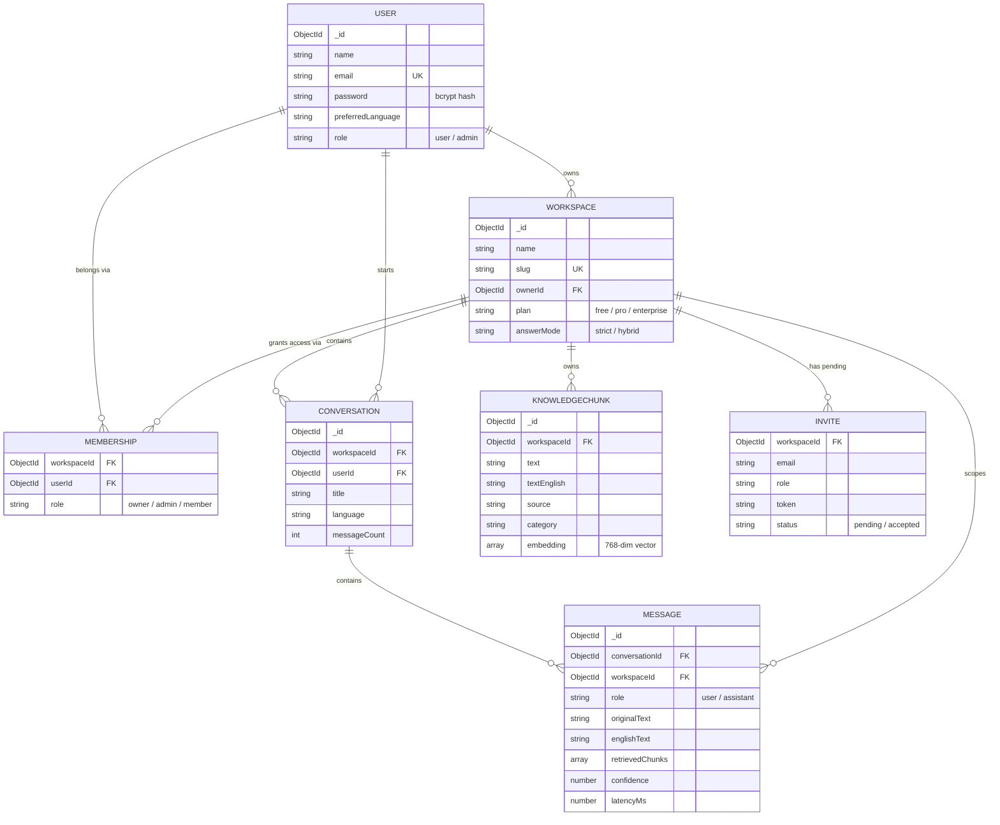
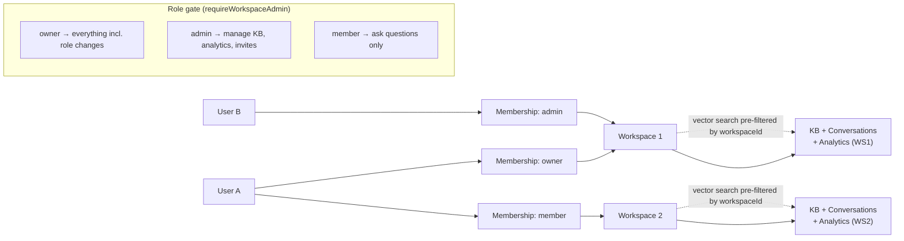
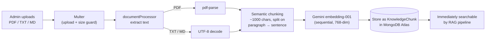
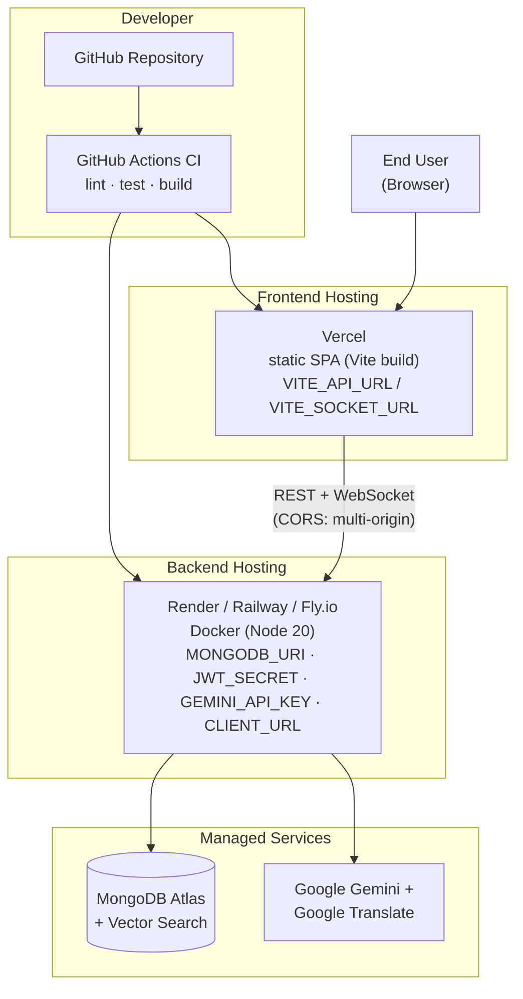
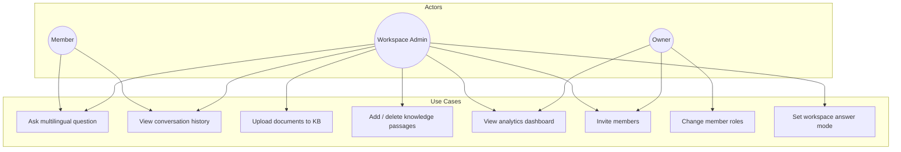

# Architecture Diagrams — IndQA

> Diagrams for the MCA report: *A Multilingual Retrieval-Augmented Question-Answering
> System for Indian Language Users Using the MERN Stack and Large Language Models.*
>
> **How to view / export:** these are [Mermaid](https://mermaid.js.org) diagrams — they
> render automatically on GitHub and in VS Code's Markdown preview. To get an image for
> your report, copy any ` ```mermaid ` block into <https://mermaid.live> and export it as
> **PNG or SVG**.

---

## 1. High-Level System Architecture

Shows the three tiers — client, server, and external cloud services — and how they
communicate (REST for CRUD, WebSocket for streamed answers).



---

## 2. RAG Question-Answering Data Flow (Sequence)

The end-to-end lifecycle of a single question, from the user's language back to the
user's language, with retrieval and streaming in between.



---

## 3. Backend Layered Architecture

The request path through the backend layers, showing separation of concerns.



---

## 4. Data Model / Entity-Relationship Diagram

The seven MongoDB collections and their relationships. `Membership` is the join entity
that gives users many-to-many access to workspaces with a role.



---

## 5. Multi-Tenancy & Role-Based Access Control

How workspace isolation and roles gate what each user can do — including the crucial
detail that isolation is enforced all the way down to vector search.



---

## 6. Document Ingestion Pipeline

How an uploaded document becomes searchable knowledge.



---

## 7. Deployment Architecture

How the system is deployed across free-tier cloud services, with CI.



---

## 8. Use-Case Overview (Actors & Actions)

A quick view of who does what in the system.


